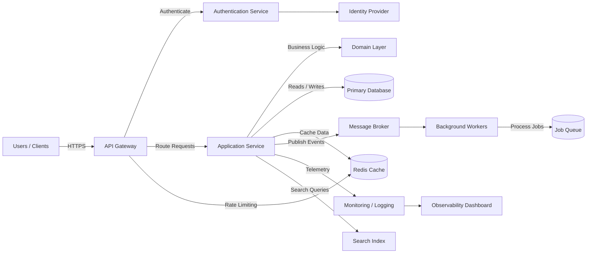

# Architecture Overview

This diagram illustrates a typical cloud-native application architecture with client access, API routing, authentication, application services, data storage, asynchronous processing, and observability.

## Components
- Users / Clients: Web, mobile, or external systems interacting with the platform.
- API Gateway: Handles request routing, authentication checks, rate limiting, and security policies.
- Authentication Service: Validates identities and issues tokens for application access.
- Application Service: Hosts the core business logic and APIs.
- Domain Layer: Encapsulates rules and processing logic for the application.
- Primary Database: Stores durable transactional data.
- Redis Cache: Improves performance by caching frequently accessed data.
- Message Broker: Enables asynchronous communication between services.
- Background Workers: Process jobs, events, and background tasks.
- Search Index: Provides fast search capabilities for indexed content.
- Monitoring / Logging: Collects traces, logs, and metrics for visibility.
- Identity Provider: External auth provider such as OAuth/OIDC or SSO.
- Observability Dashboard: Centralized view of health, errors, and performance.

## Notes
- The design separates synchronous request handling from asynchronous processing.
- Caching reduces database load for repeated read-heavy workloads.
- Event-driven communication improves scalability and decoupling between services.
- Observability is essential for diagnosing failures and improving performance.