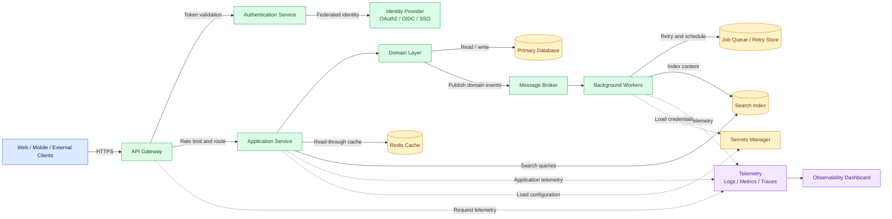

# Cloud-Native Architecture Overview

A practical, technology-agnostic reference architecture for a cloud-native application. It demonstrates how clients, an API gateway, authentication, application services, data stores, asynchronous processing, and observability can work together.

> This repository is intentionally documentation-first. It is a design reference, not a deployable production stack.

## Development workflow

This repository follows a `dev`-first branching strategy:

- `main` is reserved for release-ready or stable snapshots.
- `dev` is the integration branch for active work.
- Each feature or change set is developed on a dedicated branch such as `feature/bootstrap-gradle`, `feature/http-api`, or `feature/security-hardening`.
- Feature branches merge into `dev` only.
- `main` is updated only after validation and release readiness are confirmed.

This keeps active work isolated, reviewable, and safe while preserving a clean release branch.

## Architecture diagram

## Goals

- Provide a clear starting point for system design discussions.
- Separate synchronous API traffic from asynchronous workloads.
- Keep business rules independent from infrastructure details.
- Make security, reliability, and observability explicit design concerns.
- Allow individual infrastructure choices to evolve without changing the domain model.

## Component responsibilities

| Component | Responsibility |
| --- | --- |
| Clients | Use the platform through web, mobile, or service-to-service requests. |
| API Gateway | Terminates HTTPS, routes requests, applies rate limits, and emits edge telemetry. |
| Identity Provider | Performs federation, SSO, and identity lifecycle management. |
| Authentication Service | Validates credentials or tokens and maps identities to application permissions. |
| Application Service | Exposes APIs and coordinates use cases. |
| Domain Layer | Owns business rules, invariants, and domain events. |
| Primary Database | Stores durable transactional state and supports consistency requirements. |
| Redis Cache | Serves frequently accessed, short-lived data with an explicit invalidation strategy. |
| Message Broker | Buffers and distributes events so producers and consumers remain loosely coupled. |
| Background Workers | Execute long-running, scheduled, or retryable work outside the request path. |
| Job Queue / Retry Store | Tracks delayed work, retries, and dead-letter handling. |
| Search Index | Supports low-latency full-text and filtered search. |
| Secrets Manager | Stores credentials, keys, and sensitive runtime configuration. |
| Observability stack | Collects logs, metrics, and traces and presents actionable dashboards. |

## Request and event flows

### Synchronous request

1. A client sends an HTTPS request to the API Gateway.
2. The gateway applies transport security, rate limiting, and routing rules.
3. Authentication validates the token and authorization policy.
4. The Application Service invokes a domain use case.
5. The domain layer reads or updates the database and may use the cache.
6. The service returns a response and emits telemetry.

### Asynchronous event

1. A successful domain operation publishes an event to the message broker.
2. A worker consumes the event independently of the original request.
3. The worker updates the search index, sends notifications, or performs another side effect.
4. Failed work is retried through the job queue and eventually sent to a dead-letter path.
5. Processing metrics, logs, and traces are sent to the observability stack.

More detailed flows are documented in [`docs/flows.md`](docs/flows.md).

## Design principles

- **Defense in depth:** Secure the edge, identity boundary, services, data stores, and secrets independently.
- **Stateless application tier:** Keep request-serving instances replaceable and scale them horizontally.
- **Explicit consistency:** Use transactions for core state and events for work that can be eventually consistent.
- **Resilience by default:** Apply timeouts, bounded retries, idempotent consumers, circuit breakers, and backpressure.
- **Observable operations:** Every request and background job should have a correlation ID and useful telemetry.
- **Least privilege:** Grant each service only the permissions it needs.
- **Portable decisions:** Keep vendor-specific choices behind interfaces and document trade-offs.

## Repository guide

- [`docs/architecture-overview.md`](docs/architecture-overview.md) — detailed diagram and component catalog.
- [`docs/flows.md`](docs/flows.md) — request, event, failure, and deployment flows.
- [`docs/decisions.md`](docs/decisions.md) — architecture decision records and trade-offs.
- [`CONTRIBUTING.md`](CONTRIBUTING.md) — how to propose improvements.

## Non-functional requirements to define before implementation

| Area | Questions to answer |
| --- | --- |
| Availability | What uptime target and failure domains are required? |
| Performance | What are the p95/p99 latency and throughput targets? |
| Data | What are the retention, backup, recovery point, and recovery time objectives? |
| Security | Which data is sensitive, and what compliance controls apply? |
| Scale | Which dimensions grow: traffic, tenants, data volume, or background jobs? |
| Operations | Who owns alerts, incident response, and capacity planning? |

## License

This reference material is available under the MIT License. See [`LICENSE`](LICENSE).
