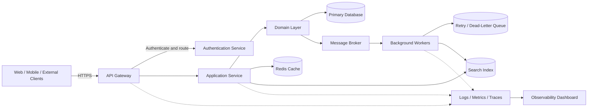

# Cloud-Native Architecture Overview

A technology-agnostic reference architecture for cloud-native applications, including the `reactive-order-engine` Java 21 implementation.

## Repository workflow

- `main` contains release-ready snapshots.
- `dev` is the integration branch.
- Feature and fix branches merge into `dev`, not `main`.
- Promote `dev` to `main` only after validation and release review.

## Architecture diagram

## Included project

[`reactive-order-engine/README.md`](reactive-order-engine/README.md) documents the Java 21 asynchronous order-processing reference implementation using Spring Boot 3.4.3, Vert.x 4.5.13, Gradle Kotlin DSL, virtual threads, validation, security headers, and a 10 KB body limit.

## Documentation

- [`docs/architecture-overview.md`](docs/architecture-overview.md) — detailed architecture and trust boundaries.
- [`docs/flows.md`](docs/flows.md) — request, event, failure, and deployment flows.
- [`docs/decisions.md`](docs/decisions.md) — architecture decision records.
- [`docs/commit-sequence.md`](docs/commit-sequence.md) — illustrative 15-minute commit sequence.

## Security disclaimer

The order engine is a hardened reference implementation, not a VAPT certification. Production use requires authentication and authorization, TLS, secrets management, durable messaging, persistence, idempotency, monitoring, and independent SAST, DAST, dependency, and penetration testing.

## License

This project is available under the MIT License. See [`LICENSE`](LICENSE).
