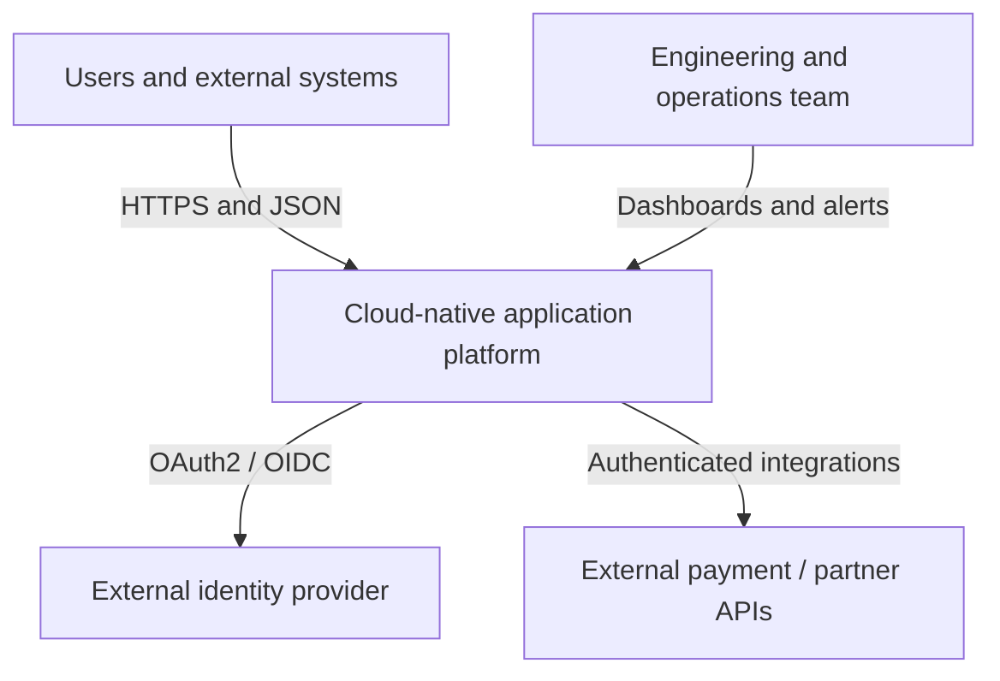
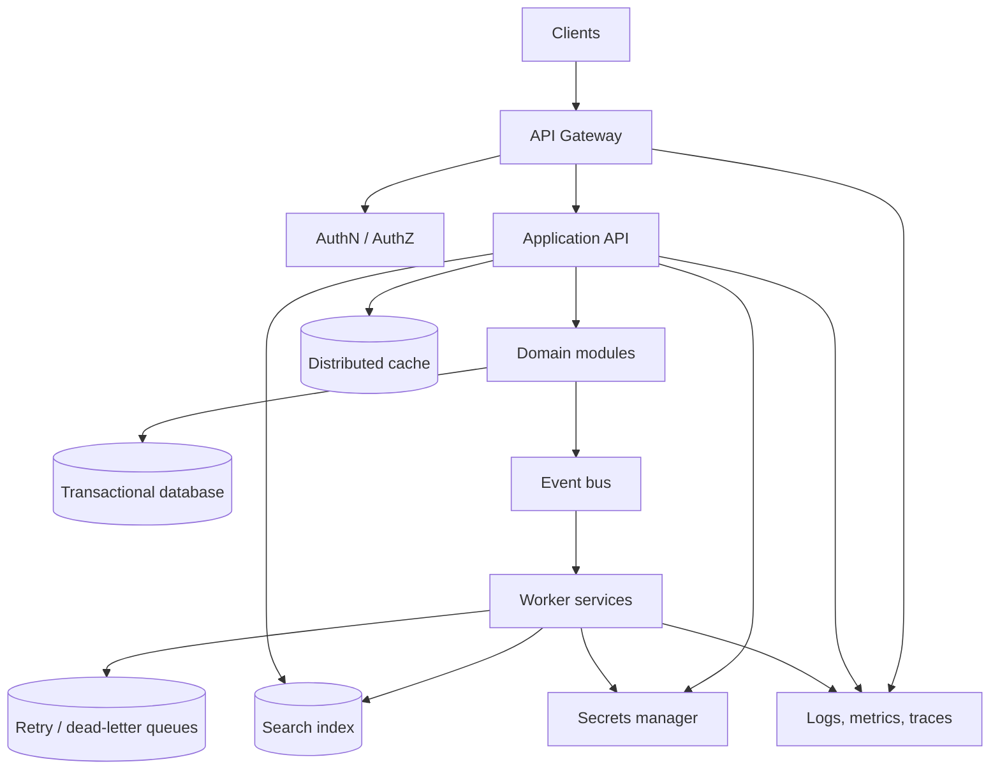

# Detailed Architecture Overview

## Context

This reference architecture models a multi-client cloud application. It intentionally avoids prescribing a cloud provider, programming language, database engine, or messaging product. Those choices should follow the workload, team capabilities, compliance requirements, and operational model.

## System context

## Container view

## Trust boundaries

1. **Public boundary:** Client traffic enters through the gateway. No internal service should be directly exposed unless explicitly required.
2. **Identity boundary:** Tokens and claims are validated before protected use cases execute.
3. **Service boundary:** Services communicate through authenticated, authorized interfaces.
4. **Data boundary:** Database, cache, search, queues, and secrets have separate credentials and network policies.
5. **Operations boundary:** Production access is audited and limited through privileged operational workflows.

## Availability and failure behavior

- Gateway health checks remove unhealthy application instances from rotation.
- Application instances remain stateless so they can be replaced or scaled horizontally.
- Database writes use transactions; read replicas may be used when eventual consistency is acceptable.
- Cache outages should degrade to the database rather than make correctness depend on cache availability.
- Message consumers must be idempotent because at-least-once delivery can repeat an event.
- Retries use exponential backoff and a maximum attempt count.
- Poison messages are isolated in a dead-letter queue for investigation.
- External dependencies use timeouts and circuit breakers.

## Security controls

- Enforce HTTPS and secure headers at the edge.
- Validate token issuer, audience, expiration, and required scopes.
- Authorize at the use-case boundary, not only at the gateway.
- Use parameterized queries and validate input at every trust boundary.
- Encrypt data in transit and at rest.
- Store secrets outside source control and rotate them regularly.
- Redact tokens, passwords, and personal data from logs.
- Audit administrative actions and sensitive data access.

## Scaling strategy

| Bottleneck | Scaling approach |
| --- | --- |
| API traffic | Add stateless application instances behind the gateway. |
| Repeated reads | Add cache-aside reads with TTLs and controlled invalidation. |
| Slow side effects | Move work to events and background workers. |
| Search load | Scale search separately from transactional storage. |
| Queue backlog | Increase consumers after checking downstream capacity. |
| Database reads | Use indexes, query tuning, read replicas, or partitioning where justified. |
| Database writes | Partition workloads, batch safely, or introduce domain-specific stores only when needed. |

## Observability

Every request and job should expose:

- A correlation ID propagated across service calls and messages.
- Structured logs with timestamp, severity, component, operation, and outcome.
- Metrics for request rate, errors, latency, saturation, queue depth, and consumer lag.
- Distributed traces for gateway-to-service and service-to-worker paths.
- Alerts tied to user impact and actionable runbooks.

## Open implementation decisions

Before production implementation, decide the cloud provider, deployment platform, API style, database technology, broker semantics, identity provider, SLOs, backup strategy, and ownership model. Record each decision and its rationale in [`decisions.md`](decisions.md).
