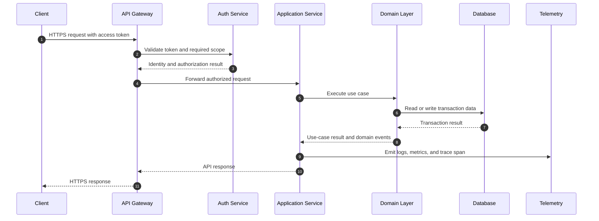
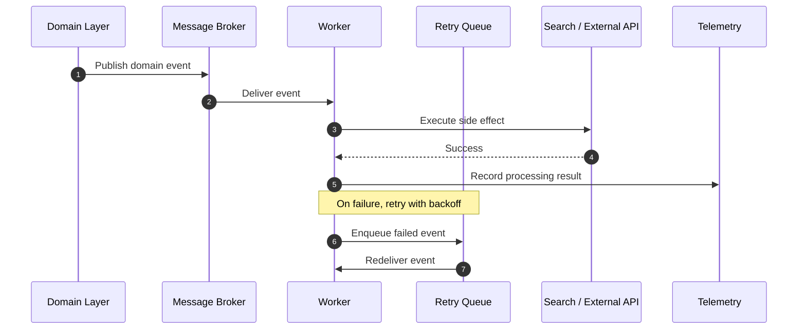
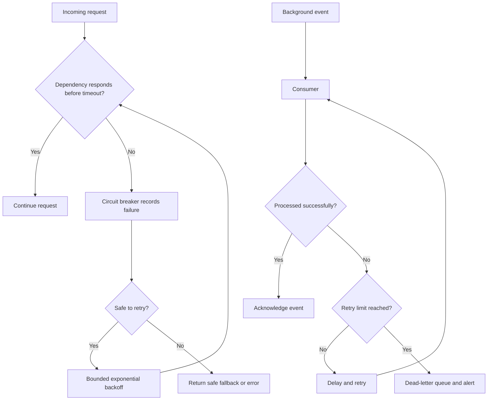

# Runtime Flows

## Request flow

## Event flow

## Failure flow

## Deployment flow

1. A change is submitted through a pull request.
2. Automated checks validate Markdown, Mermaid syntax where supported, security policy, and documentation links.
3. A reviewed change is merged into the default branch.
4. The deployment system builds immutable artifacts and scans dependencies.
5. The release is deployed progressively, with health checks and rollback criteria.
6. Dashboards and alerts verify service-level objectives after deployment.

## Operational checklist

- [ ] Health and readiness checks exist for each deployable service.
- [ ] Timeouts are configured for every network dependency.
- [ ] Retries are bounded and safe for the operation.
- [ ] Consumers are idempotent.
- [ ] Queue depth and dead-letter volume are monitored.
- [ ] Backups are tested, not only configured.
- [ ] Runbooks exist for common alerts.
- [ ] Logs exclude credentials and sensitive personal data.
